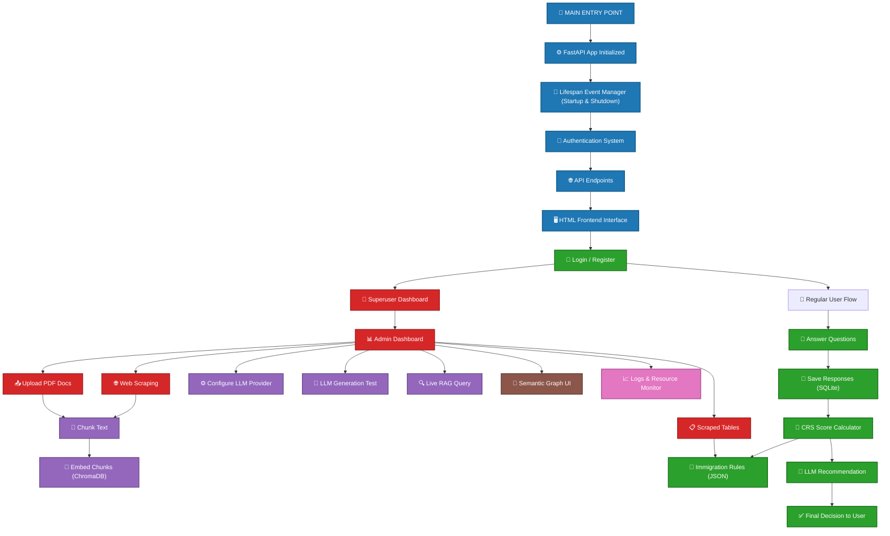

```mermaid
flowchart TD
    %%=== Main Flow ===%%
    MAIN["🚀 MAIN ENTRY POINT"] --> FASTAPI["⚙️ FastAPI App Initialized"]
    FASTAPI --> LIFE["🧠 Lifespan Event Manager (Startup & Shutdown)"]

    LIFE --> AUTH["🔐 Authentication System"]
    AUTH --> API["🌐 API Endpoints"]
    API --> UI["🖥️ HTML Frontend Interface"]

    UI --> LOGGING["👥 Login / Register"]
    LOGGING --> SUPER["👑 Superuser Dashboard"]
    LOGGING --> USER["🙋 Regular User Flow"]

    USER --> QUESTIONFLOW["📝 Answer Questions"]
    QUESTIONFLOW --> SAVEQUE["💾 Save Responses (SQLite)"]
    SAVEQUE --> CRS["🧮 CRS Score Calculator"]
    CRS --> RULES["📜 Immigration Rules (JSON)"]
    CRS --> LLMRECOMMEND["🤖 LLM Recommendation"]
    LLMRECOMMEND --> FINAL["✅ Final Decision to User"]

    SUPER --> DASHBOARD["📊 Admin Dashboard"]
    DASHBOARD --> UPLOAD["📤 Upload PDF Docs"]
    DASHBOARD --> SCRAPING["🌐 Web Scraping"]
    SCRAPING --> CHUNKING["🔪 Chunk Text"]
    UPLOAD --> CHUNKING
    CHUNKING --> EMBEDDING["🧬 Embed Chunks (ChromaDB)"]

    DASHBOARD --> LLMCONFIG["⚙️ Configure LLM Provider"]
    DASHBOARD --> LLMGEN["🤖 LLM Generation Test"]
    DASHBOARD --> LIVERAG["🔍 Live RAG Query"]
    DASHBOARD --> GRAPHUI["🧠 Semantic Graph UI"]
    DASHBOARD --> MONITOR["📈 Logs & Resource Monitor"]

    DASHBOARD --> TABLESCARPING["📋 Scraped Tables"]
    TABLESCARPING --> RULES

    %%=== Styling ===%%
    classDef core fill:#1f77b4,color:#fff,stroke:#145a86,stroke-width:2px;
    classDef user fill:#2ca02c,color:#fff,stroke:#1b6f1b,stroke-width:2px;
    classDef super fill:#d62728,color:#fff,stroke:#a02020,stroke-width:2px;
    classDef llm fill:#9467bd,color:#fff,stroke:#6b4e8a,stroke-width:2px;
    classDef graphUIClass fill:#8c564b,color:#fff,stroke:#5c3d2f,stroke-width:2px;
    classDef misc fill:#e377c2,color:#fff,stroke:#b04f9c,stroke-width:2px;

    class MAIN,FASTAPI,LIFE,AUTH,API,UI core;
    class LOGGING,QUESTIONFLOW,SAVEQUE,CRS,RULES,LLMRECOMMEND,FINAL user;
    class SUPER,DASHBOARD,UPLOAD,SCRAPING,TABLESCARPING super;
    class CHUNKING,EMBEDDING,LLMCONFIG,LLMGEN,LIVERAG llm;
    class GRAPHUI graphUIClass;
    class MONITOR misc;
```